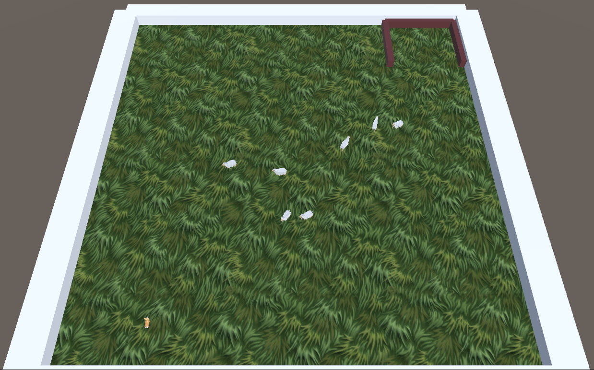
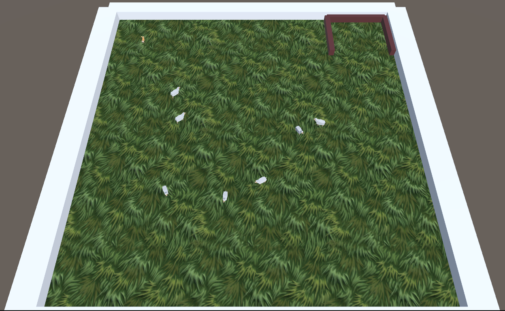
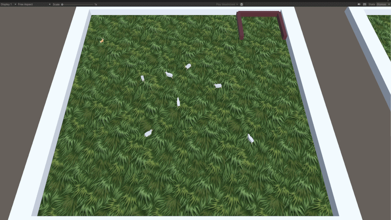
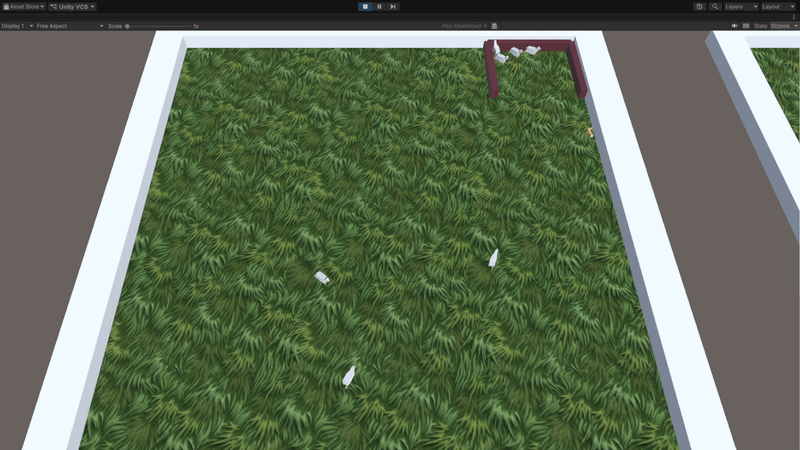

# Sheep Herding Unity ML-Agents Reinforcement Learning

A reinforcement learning environment built with Unity 2023 and ML-Agents 2.0, where an AI sheepdog learns to herd a flock of sheep into a pen using Proximal Policy Optimization (PPO).


[](https://youtu.be/QVnRGA8Kcm0)

---

## Overview

The agent (sheepdog) observes its surroundings via a vector of continuous inputs and a set of ray-cast sensors, then outputs continuous 
movement actions to round up all sheep. 

**Key features:**
- Continuous action space (forward/strafe/rotate)
- Multi-signal reward shaping: per-step progress, per-sheep completion bonuses, scatter penalties
- ScriptableObject settings for easy hyperparameter tuning without code changes

---

## Project Structure

```
SheepHerding/
├── Assets/
│   ├── Scripts/
│   │   ├── SheepdogAgent.cs       # ML-Agents Agent subclass (observations, actions, rewards)
│   │   ├── SheepdogMovement.cs    # Rigidbody physics movement (decoupled from RL)
│   │   ├── SheepController.cs     # Individual sheep AI (wander / flee / flock)
│   │   ├── FlockingSystem.cs      # Reynolds flocking rules (separation, cohesion, alignment)
│   │   ├── ArenaManager.cs        # Episode lifecycle: spawn, reset, statistics
│   │   ├── GoalPen.cs             # Trigger-based pen tracking and events
│   │   └── SheepHerdingSettings.cs # ScriptableObject for all tunable parameters
│   └── Scenes/
│       └── SampleScene.unity
├── Config/
│   └── SheepHerding.yaml          # ML-Agents training configuration
├── results/                        # Training run outputs (TensorBoard logs, checkpoints, ONNX)
│   ├── sheep_run_01 … sheep_run_06
│   ├── sheep_run_curriculum
│   └── sheep_run_curriculum2
└── Packages/
    └── manifest.json
```

---

## Requirements

### Unity
- **Unity** 2023.1.22f1
- **ML-Agents Unity package** 2.0.2 (included in `Packages/manifest.json`)
- **Barracuda** 3.0.0 (auto-installed as dependency)

### Python (for training)
- Python 3.8–3.10
- `mlagents` 0.30+

```bash
pip install mlagents
```

---

## Getting Started

### 1. Clone and open in Unity

```bash
git clone https://github.com/tobp03/sheep-herding.git
```

Open the project in Unity Hub using Unity **2023.1.22f1**, then open `Assets/Scenes/SampleScene.unity`.

### 2. Run in heuristic mode (keyboard control)

In the Inspector, set the `SheepdogAgent` **Behavior Type** to `Heuristic Only` and press Play.

| Key | Action |
|-----|--------|
| W / S | Move forward / backward |
| A / D | Strafe left / right |
| Q / E | Rotate left / right |

### 3. Train with ML-Agents

Start a training run from the project root:

```bash
mlagents-learn Config/SheepHerding.yaml --run-id=sheep_run_01
```

Then press **Play** in the Unity Editor. Training results and checkpoints are saved to `results/sheep_run_01/`.

Monitor training progress with TensorBoard:

```bash
tensorboard --logdir results
```

### 4. Run with a trained model

Copy the exported `.onnx` file from `results/<run-id>/` into `Assets/` and assign it to the `SheepdogAgent` **Model** field in the Inspector. Set **Behavior Type** back to `Inference Only` and press Play.

---

## Agent Design

### Observations (7 floats + ray sensors)

| Input | Description |
|-------|-------------|
| Normalized velocity | Agent's current speed direction |
| Forward direction | Facing vector |
| Nearby sheep fraction | Proportion of sheep within detection radius |
| Distance to pen | Normalized distance to goal |
| Sheep-in-pen progress | Fraction of flock already penned |

Ray-cast sensors detect: **Sheep**, **Walls**, **Obstacles**, **GoalPen**

### Actions (3 continuous)

| Action | Range | Effect |
|--------|-------|--------|
| Forward / backward | [−1, 1] | Move along local Z axis |
| Strafe | [−1, 1] | Move along local X axis |
| Rotate | [−1, 1] | Yaw rotation |

### Reward Shaping

| Event | Reward |
|-------|--------|
| Per step (time pressure) | −0.0002 |
| Sheep moving toward pen | +0.05 per unit improvement |
| Sheep enters pen | +2.0 (once per sheep) |
| Persistence: sheep in pen | +0.002 × count per step |
| Flock scatter penalty | −0.005 |
| All sheep penned (completion) | +8.0 × sheep count |
| Wall collision | −0.02 |
| Episode timeout | −1.0 |

---

## Sheep Behaviour

Each sheep blends three behaviours every physics tick:

1. **Wander** — random directional drift (strength 1.2)
2. **Flee** — escape from dog within fear radius of 6 units (flee speed 6.0)
3. **Flock** — Reynolds rules via `FlockingSystem.cs`
   - Separation radius: 1.8 units (avoids crowding)
   - Cohesion radius: 8.0 units (neighbourhood awareness)
   - Weights: separation 2.0 · cohesion 0.8 · alignment 0.6

Wall avoidance is handled via 4-direction raycasting to prevent corner trapping.

---

## Training Configuration

Key hyperparameters from `Config/SheepHerding.yaml`:

| Parameter | Value |
|-----------|-------|
| Algorithm | PPO |
| Max steps | 5,000,000 |
| Batch size | 1024 |
| Buffer size | 10240 |
| Learning rate | 3.0e-4 (linear decay) |
| Gamma (discount) | 0.995 |
| Lambda (GAE) | 0.95 |
| Hidden units | 256 × 3 layers |
| Episode length | 128 steps |

The high gamma (0.995) encourages the agent to plan over longer horizons, important for a task where the final completion bonus only arrives after all sheep are penned.

---

## Settings

All tunable parameters are exposed on a `SheepHerdingSettings` ScriptableObject. Create one via **Assets > Create > SheepHerding > Settings** and assign it in the scene.

| Category | Parameter | Default |
|----------|-----------|---------|
| Dog movement | Move speed | 8.0 |
| Dog movement | Rotate speed | 180 °/s |
| Dog movement | Strafe speed | 5.0 |
| Sheep | Move speed | 3.5 |
| Sheep | Fear radius | 6.0 |
| Sheep | Flee speed | 6.0 |
| Episode | Max duration | 120 s |
| Episode | Sheep count | 5 |
| Arena | Spawn area half-size | 7.0 |

---

## Results

The `results/` directory contains six standard training runs and two curriculum learning experiments. Trained `.onnx` models are included for inference.

To view all runs in TensorBoard:

```bash
tensorboard --logdir results
```

### Dog Spawn Position 

Across the runs, one of the most impactful configuration changes was the dog's spawn position relative to the pen.

**Initial position:**



In the early runs the dog spawned directly opposite the pen — on the far side of the arena. This turned out to be an inadvertent shortcut: because sheep flee from the dog, placing the dog behind the flock meant the sheep were already being pushed toward the pen just by the dog's presence. The agent could accumulate rewards passively, without ever learning a genuine herding strategy.

**Updated position:**



Moving the dog's spawn to a different side of the arena removed this free ride. Now the sheep don't naturally drift toward the pen when the dog approaches — the agent has to actively outmanoeuvre the flock, cut off escape routes, and drive sheep in the right direction. This single change significantly increased task difficulty and forced the agent to develop more purposeful behaviour.

### Training Progression

**~850k steps — early herding behaviour**



By 850k steps the agent has learned the core loop: chase the flock, get behind the sheep, and push them toward the pen. Movement is still fairly direct and the agent struggles when sheep scatter.

**~4.8M steps — refined strategy**



By the end of training the agent shows noticeably more sophisticated behaviour, herding multiple sheep simultaneously, and doubling back to collect stragglers that drifted away from the group. That said, it still couldn't reliably capture the full flock: peak performance was typically 5–6 out of 7 sheep penned per episode. Getting that last sheep, which tends to flee to a corner while the dog is occupied with the group, remained an open challenge.

---

## Assets Used

- [LOW POLY CUBIC — Goat and Sheep Pack](https://assetstore.unity.com) — sheep models & animations
- [3D Stylized Animated Dogs Kit](https://assetstore.unity.com) — sheepdog model
- [Stylized Grass Texture](https://assetstore.unity.com) — ground material
- [TextMesh Pro](https://docs.unity3d.com/Manual/com.unity.textmeshpro.html) — UI text

---

## License

This project is released under the [MIT License](LICENSE).
